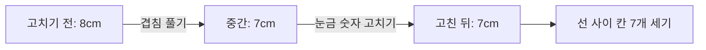

# 마지막 단계 축하 화면 및 기준봉 측정값 차이 개선 계획

**작성일:** 2026-08-15  
**대상 앱:** 화면 속 자 정비소  
**요청 기준:** 첨부 화면은 현재 5단계 완료 직전 상태를 보여 주는 참고 자료로 사용하고, 아래 두 가지를 실제 구현 범위로 삼습니다.

## 1. 요청과 첨부 자료의 구분

### 실제 구현 요청

1. 마지막 미션까지 끝나면 축하 애니메이션/반응형 오버레이를 보여 줍니다.
2. 축하 화면에서 처음 화면으로 돌아갈 수 있어야 합니다.
3. 기준봉이 고장난 동안에는 잘못된 측정값이 보이고, 고친 뒤에는 올바른 값으로 바뀌어야 합니다.
4. 단계 전체에서 고치기 전과 고친 뒤의 숫자 차이가 학생에게 보이고, 숫자 변화가 고장 원인과 연결되어야 합니다.

### 첨부 화면에서 확인한 참고 사항

- 현재 5/5 단계이며, `고치기 전 숫자`와 `고친 뒤 길이` 비교 상자가 보입니다.
- 첨부 화면의 숫자와 문구는 현재 UI의 상태를 확인하는 참고 자료이지, 별도의 콘텐츠 요구사항으로 추가하지 않습니다.
- 브라우저 주소와 상단 브라우저 UI는 앱 기능이 아니므로 수정 대상에서 제외합니다.

## 2. 현재 코드에서 확인한 원인

- `app/page.tsx`의 비교표는 항상 `mission.brokenReading`과 `mission.length`를 직접 출력합니다.
- `app/lib/mission-data.mjs`의 `getReadingAfterRepair()`는 미션이 완전히 고쳐졌는지만 보고 길이를 반환합니다.
- 따라서 부분 수리 중에는 현재 읽을 수 있는 값이 계산되지 않고, 완료 전후의 상태 변화가 숫자로 연결되지 않습니다.
- 마지막 미션은 겹침과 숫자 고장을 두 번 고쳐야 하지만, 두 수리 사이의 측정값이 화면에 드러나지 않습니다.

## 3. 개선 설계

### 3-1. 수리 상태별 측정값

미션 데이터에 `readingByRepairs`를 추가하고, 선택한 수리 목록으로 현재 읽기값을 계산합니다.

| 상태 | 학생에게 보일 값 | 학습 의미 |
|---|---:|---|
| 수리 전 | `brokenReading` 또는 `길이를 정할 수 없어요` | 고장난 기준봉을 그대로 읽은 값 |
| 일부 수리 | `readingByRepairs`의 해당 값 | 한 고장을 고치면 숫자가 어떻게 달라지는지 관찰 |
| 모두 수리 | `length` | 같은 크기 칸을 세어 얻은 바른 값 |

`unequal-unit-widths`처럼 고장난 숫자를 정수로 확정하기 어려운 경우는 수리 전 값을 숫자로 만들지 않고 `길이를 정할 수 없어요`로 유지합니다. 고친 뒤에만 실제 모형 칸 수를 보여 줍니다.

### 3-2. 마지막 미션 단계 예시

숫자 고장만 고친 단계에서는 실제 칸 수가 아직 틀릴 수 있으므로, 수리 순서에 따라 중간값을 데이터로 명시합니다. 학생이 버튼을 누른 결과가 작업대 그림과 비교표 모두에 반영되도록 합니다.

### 3-3. 완료 축하 오버레이

- `session.missionIndex`가 마지막 미션이고 `chooseReason`이 정답을 고른 순간을 전체 미션 완료 시점으로 판정합니다.
- `celebrationOpen` 상태를 열어 화면 중앙의 반응형 오버레이를 표시합니다.
- 별/색종이 모양은 CSS 애니메이션으로 표현하고, `prefers-reduced-motion`에서는 정적인 축하 화면으로 표시합니다.
- 축하 문구는 `정비 완료!`와 `5개의 화면 속 자를 모두 고쳤어요.`처럼 짧게 씁니다.
- `처음 화면으로` 버튼은 세션, 기록, 튜토리얼 상태를 초기화하고 `#welcome-title`로 이동합니다.
- `기록 보기` 버튼은 기존 마지막 기록 목록을 유지한 채 오버레이만 닫습니다.

## 4. 구현 파일과 검증

- `app/lib/mission-data.mjs`: 수리 상태별 읽기값과 검증 규칙 추가
- `app/page.tsx`: 현재 읽기값 연결, 마지막 완료 상태, 축하 오버레이와 처음 화면 이동 추가
- `app/components/CelebrationOverlay.tsx`: 축하 UI 분리(파일 500줄 제한 준수)
- `app/globals.css`: 오버레이, 색종이, `gi-pulse` 강조 효과와 반응형 스타일 추가
- `tests/domain-content.test.mjs`: 부분 수리별 읽기값 테스트 추가
- `tests/rendered-html.test.mjs`: 새 축하 문구가 서버 HTML에 포함되는지 확인
- 앱의 `업데이트 내역`: 2026-08-15 개선 내역 추가

검증은 `npm test`, `npm run lint`, 마지막 미션 실사용 흐름(두 수리 → 칸 세기 → 이유 선택 → 축하 → 처음 화면)을 순서대로 실행합니다. 교육용 단계 버튼에는 `gi-pulse` 아우라를 적용해 다음에 눌러야 할 행동을 강조합니다.

## 5. 구현 완료 기록

**반영일:** 2026-08-15  
**버전:** v1.2.0

- 각 미션에 수리 조합별 읽기값을 넣고 `getReadingForRepairs()`로 현재 숫자를 계산했습니다.
- 마지막 복합 미션은 `8cm → 7cm → 7cm`로 바뀌어 겹침과 눈금 숫자 고침의 효과가 각각 보이게 했습니다.
- 틈·겹침·시작점·칸 크기 그림도 실제 수리 버튼을 누른 상태에 맞춰 부분적으로 바뀌도록 연결했습니다.
- 마지막 이유를 맞히면 축하 오버레이가 열리고, `처음 화면으로`는 튜토리얼 첫 화면으로, `내 기록 보기`는 마지막 기록으로 이동합니다.
- 축하 화면은 작은 화면에서 버튼을 세로로 쌓고, `prefers-reduced-motion`에서는 애니메이션을 줄입니다.
- 단계 선택·수리·완료 버튼에 `gi-pulse` 강조 효과를 적용하고 업데이트 내역에 v1.2.0을 추가했습니다.

### 검증 결과

- `npm test`: 9개 테스트 모두 통과
- `npm run lint`: 통과
- `npm run build:pages`: 통과
- `git diff --check`: 통과
