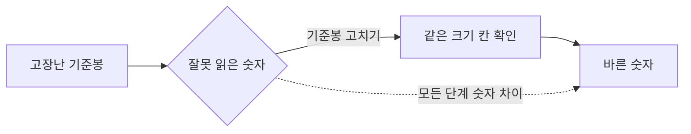

# 수정 전·수정 후 측정값 차이 점검 및 개선 계획

**작성일:** 2026-08-16  
**대상:** 5개 정비 미션의 `고치기 전 숫자 → 고친 뒤 길이` 흐름

## 요청과 점검 결과

사용자 요청은 첨부 화면의 장식이나 브라우저 UI를 바꾸는 것이 아니라, 모든 미션에서 학생이 기준봉을 고치기 전의 잘못된 숫자와 고친 뒤의 바른 숫자를 비교하도록 만드는 것입니다.

현재 데이터 점검 결과는 다음과 같습니다.

| 단계 | 기존 값 | 문제 | 수정 값 |
|---|---:|---|---:|
| 1. 시작점 | 6 → 5 | 차이 있음 | 6 → 5 유지 |
| 2. 틈 | 4 → 5 | 사용자가 기대한 고장 전 숫자 6과 다름 | **6 → 5** |
| 3. 겹침 | 6 → 5 | 차이 있음 | 6 → 5 유지 |
| 4. 칸 크기 | 값 없음 → 6 | 고치기 전 숫자가 없어 비교가 끊김 | **7 → 6** |
| 5. 복합 고장 | 8 → 7 | 차이 있음 | 8 → 7 유지 |

## 구현 계획

1. 미션 데이터의 `brokenReading`과 `readingByRepairs`를 모두 숫자로 통일합니다.
2. 모든 미션에 대해 `brokenReading !== length`를 검증하는 테스트를 추가합니다.
3. 2단계 설명을 `틈 때문에 6cm처럼 읽었어요`로 바꾸고, 4단계는 `7cm처럼 읽었어요 → 6cm` 흐름을 안내합니다.
4. 4단계 SVG의 잘못된 끝 숫자도 7로 표시해 비교 상자와 그림이 어긋나지 않게 합니다.
5. 화면 비교 상자는 수리 전에는 `고치기 전 숫자`, 수리 후에는 `지금 읽는 숫자`와 `고친 뒤 길이`를 보여 주도록 기존 계산 함수를 그대로 사용합니다.
6. 업데이트 내역에 이번 측정값 감사 결과를 기록합니다.

## 학습 흐름 시각화

## 검증 기준

- 다섯 미션의 수정 전 값은 모두 숫자입니다.
- 다섯 미션 모두 수정 전 값과 수정 후 값이 다릅니다.
- 2단계는 정확히 `6cm → 5cm`입니다.
- 4단계는 정확히 `7cm → 6cm`이며 그림의 마지막 숫자도 일치합니다.
- `npm test`, `npm run lint`, `npm run build:pages`가 통과합니다.

## 구현 완료 기록

**반영일:** 2026-08-16  
**버전:** v1.2.1

- 2단계 틈 미션을 `6cm → 5cm`로 수정했습니다.
- 숫자가 없던 4단계 칸 크기 미션을 `7cm → 6cm`로 수정하고 그림의 끝 숫자도 7로 맞췄습니다.
- 전체 미션을 `6→5, 6→5, 6→5, 7→6, 8→7`로 검증하는 회귀 테스트를 추가했습니다.
- 업데이트 내역에 v1.2.1 측정값 개선 내용을 추가했습니다.

검증 결과: `npm test` 10개 통과, `npm run lint` 통과, `npm run build:pages` 통과, `git diff --check` 통과.

## 공개 브라우저 재현 결과 및 비교 상자 보완

2026-08-16 공개 GitHub Pages에서 튜토리얼부터 3단계 완료까지 실제 버튼으로 재현했습니다. 3단계 완료 화면에서 왼쪽이 `지금 읽는 숫자 5cm`, 오른쪽이 `고친 뒤 길이 5cm`가 되는 문제를 확인했습니다.

원인은 수리 상태별 숫자 계산이 아니라, 최종 비교 상자의 왼쪽 값을 현재 수리 상태의 숫자로 바꾸고 있었던 표시 로직입니다. 최종 비교에서는 최초의 잘못된 숫자를 계속 보여 주도록 다음과 같이 보완합니다.

- 수리 중: 현재 수리 상태에 따른 `지금 읽는 숫자`
- 이유 선택·완료: 최초 `고치기 전 숫자`와 `고친 뒤 길이`를 나란히 표시
- 최종 3단계 예시: `고치기 전 숫자 6cm` / `고친 뒤 길이 5cm`

이 변경 뒤 공개 브라우저에서 3단계 완료 화면을 다시 확인하고, `6cm → 5cm`가 유지되는지 검증합니다.
